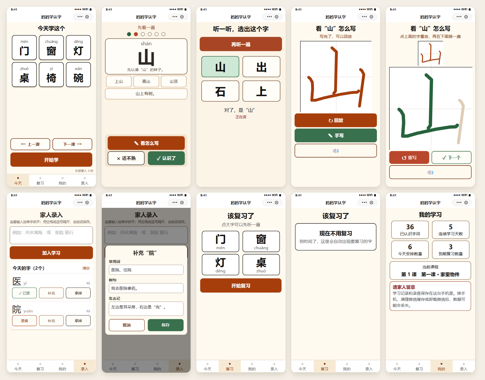
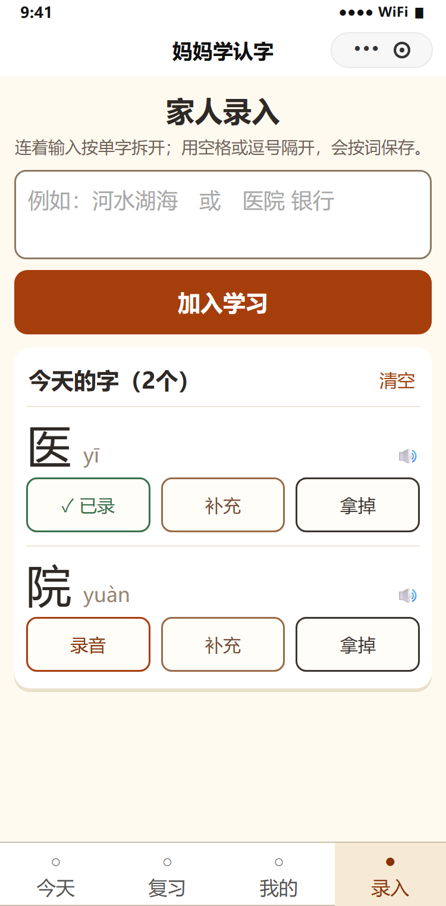
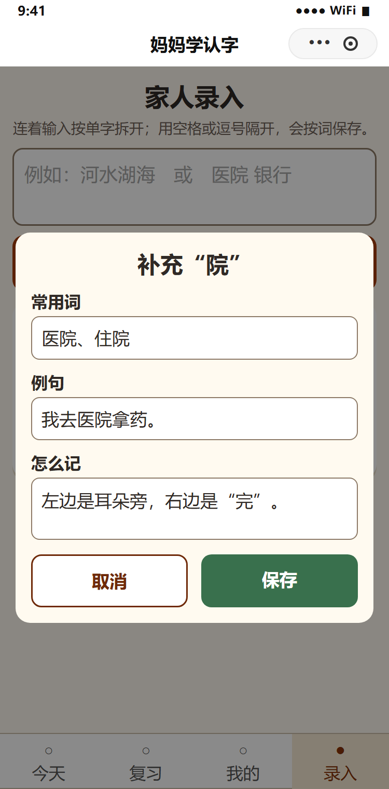

# 妈妈学认字

> 给不识字的长辈做的一款「听音认字」微信小程序。
> 一台手机、一个人用，不用注册登录，装好就能学；**所有数据都留在这台手机里，不联网、不上传**。


---

## 目录

- [这是什么](#这是什么)
- [界面预览](#界面预览)
- [两种角色怎么用](#两种角色怎么用)
- [功能清单](#功能清单)
- [跑起来（从零开始，不需要会编程）](#跑起来从零开始不需要会编程)
- [改成你自己的（名称、图标、AppID）](#改成你自己的名称图标appid)
- [项目结构](#项目结构)
- [内置内容](#内置内容)
- [数据存在哪](#数据存在哪)
- [隐私与安全](#隐私与安全)
- [设计上的一些取舍](#设计上的一些取舍)
- [已知限制](#已知限制)
- [数据来源与致谢](#数据来源与致谢)
- [许可](#许可)

---

## 这是什么

学习者识字不多，但**说话一点问题没有**。她缺的不是语言能力，是「声音」和「字形」之间那根线。

这个小程序就是来连这根线的：

1. **先听** —— 点一下字，手机就读出来（优先读家人自己录的声音）。
2. **再看** —— 大字 + 拼音 + 一句大白话讲这个字怎么记。
3. **再选** —— 听读音，从 4 个大字里选出听到的那个，确认真的记住了。

不是给小孩做的识字 App，也不是语文学习软件。它只有一个目标：**让一位不识字的长辈，在自己家里、自己的手机上，认识生活中真正会用到的那些字。**

因为使用者可能完全不会打字、不认字，所以整个产品里**没有任何一处需要学习者输入文字** —— 她能做的只有三件事：点、听、选。

---

## 界面预览



### 家人录入（长按 3 秒才进得去）

| 家人录入 | 补充资料 |
|---|---|
|  |  |
| 输入一串字点「加入学习」，就能一行一行地录音、补充、拿掉 | 每个字词都能补常用词、例句和记忆提示 |

---

## 两种角色怎么用

### 学习者

打开小程序，一天只需要三个动作：

| 步骤 | 做什么 | 对应按钮 |
|---|---|---|
| 1 | 看看今天要学什么，点一下大字先听一遍 | 点字卡 |
| 2 | 一个字一个字地学，会了就点「认识了」，不确定就点「还不熟」 | 开始学 |
| 3 | 学完做几道「听音选字」，然后收工 | 自动进入 |

几个刻意的设计：

- **不需要打字，不需要登录，不需要选班级。**
- 答错**不批评、不放刺耳音效**，只温和地显示正确答案并再读一遍，停留时间也长一点。
- 进度用**一排大圆点**表示，而不是「第 2/4 个」这种要读数字才懂的形式。
- 一轮里标记「还不熟」的字，会在**本轮末尾再出现一次**；第二轮不再无限循环。
- 底部四个标签：**今天 / 复习 / 我的 / 录入**。

### 家人（负责录入）

「录入」是**家人专用的隐藏入口** —— 必须在底部导航的「录入」上**按住 3 秒**才会进入，防止老人误触。按住时按钮上会显示 3、2、1 倒计时。

进去之后可以做这些事：

| 想做的事 | 怎么操作 |
|---|---|
| 加几个字 | 连着输入「河水湖海」，点「加入学习」，自动拆成 4 张单字卡并加入今天 |
| 加几个词 | 用空格或逗号隔开：「医院 银行」，点「加入学习」，得到 2 张词卡 |
| 听读音 | 点列表里的字词；有家人录音时优先播放家人录音 |
| 补充资料 | 点字词右边的「补充」，填写常用词、例句和怎么记 |
| 录自己的读音 | 点「录音」，按 3、2、1 倒计时录制，最长约 4 秒；已经录过的显示「✓ 已录」 |
| 调整今天的安排 | 点某个字词的「拿掉」，或点右上角的「清空」 |
| 不想要今天的自定义内容 | 什么都不用做 —— 第二天自动回到内置课程进度 |

> 拼音会**按离线拼音表自动填好**，常用组词也会自动给几个，家人通常只需要录个音就行。
>
> 「拿掉」和「清空」只影响今天的学习安排，**录音和补充信息会保留**，重新加回来还在。

---

## 功能清单

### 今天（首页）
- 一天 6 个字，做成 6 张大卡片：上面拼音、下面大字，点一下立刻听读音。
- 「开始学」主按钮上方有「上一课」「下一课」，可以手动切换当天的默认课程。
- 默认课程**一天固定一课**；当天学完后仍停留在本课，可以再学一遍，**第二天才自动进入下一课**。
- 家人当天主动安排了内容时，优先显示家人安排的内容，这时「上一课 / 下一课」会自动隐藏。

### 字卡学习
- 每张卡包含：大字/词、拼音、怎么记、常用组词、例句。
- 进入自动读一遍；点字、点常用词、点例句都能**分别发音**。
- 顶部用一排大圆点表示进度：绿点是学过的，红点是当前这个。
- 三个按钮：「看怎么写」「还不熟」「认识了」。

### 听音选字
- 自动读题，从最多 4 个大字里选。
- **干扰项只从教过的字里取**，不会冒出没学过的字；**同音字不作为干扰项**（避免听音无法区分）。
- 选完显示正确答案并再读一遍，答对停 0.9 秒、答错停 1.7 秒，都留足反应时间。

### 复习
- 自动列出到期该复习的字，点大字可听读音。
- 「开始复习」复用字卡学习 + 听音选字的完整流程。
- 没有到期内容时，用大白话显示空状态，不是冷冰冰的「暂无数据」。

### 笔顺和描红
- 从字卡点「看怎么写」进入。
- 用小程序原生 canvas 播放**逐笔笔顺动画**，不依赖任何浏览器端第三方库。
- 三个按钮：「回放」（重看笔顺）、「手写」（进入描红）、「🔊」（听这个字怎么读）。
- 描红模式下：上半屏缩小成对照窗口，下半屏是大号描红区；写完有「重写」和「下一个」。
- 描红区尽量大，方便手指书写，并避开底部系统手势区。
- 没有该字的笔顺数据时，显示「这个字还没有笔顺动画，可以在下面照着写」，**不白屏**。

### 我的
- 已认识字词数、连续学习天数、今天安排数量、到期复习数量、当前课程。
- 明确提醒：**本地数据在换手机、清理微信缓存或卸载后会丢失。**

---

## 跑起来（从零开始，不需要会编程）

这一节写给**完全没写过代码、也没装过开发工具**的人。照着做，大概 15–30 分钟就能在自己手机上看到它跑起来。

### 第 0 步：先理解一件事 —— 小程序不是 App

这是最容易卡住的地方，先花一分钟搞明白：

- 微信小程序**不能像普通 App 那样下载安装包双击安装**，也不能直接从 GitHub 上「下载运行」。
- 它必须通过一个叫 **微信开发者工具** 的官方软件「编译」一下，才能生成能跑的东西。
- 在手机上用它的方式有两种：**预览**（临时看，二维码有时效，只能你自己扫）和**体验版**（长期用，家人也能扫）。

所以整个流程是：**下载代码 → 装开发者工具 → 导入 → 编译 → 手机上打开**。

> 好消息：这个项目**零第三方依赖**，不需要装 Node.js、不需要 `npm install`，音频和笔顺数据都在仓库里，克隆完就能离线跑。

### 第 1 步：把代码下载到电脑

**方法 A（推荐，不需要懂命令行）**

1. 打开项目主页：<https://github.com/paidad/StudyMM_chinese-literacy-miniprogram>
2. 点右上角绿色的 **`Code`** 按钮 → 在下拉菜单里选 **`Download ZIP`**
3. 把下载到的 zip 解压到一个**好找、路径简单**的位置，比如 `D:\妈妈学认字`
   - 建议避开中文用户名下的桌面深层目录，省得后面选路径时找不着
4. 打开解压出来的文件夹，确认**第一层**就能看到这些东西：

```
app.json
app.wxss
pages\
study\
stroke\
data\
audio-py\
```

**✅ 检查点**：如果你看到的是「一个文件夹里又套了一个同名文件夹」，请进到里面那一层，直到看见 `app.json` 为止。**记住这个路径，第 3 步要用。**

**方法 B（已经装了 git 的人）**

```bash
git clone https://github.com/paidad/StudyMM_chinese-literacy-miniprogram.git
```

### 第 2 步：安装微信开发者工具

1. 打开官方下载页：<https://developers.weixin.qq.com/miniprogram/dev/devtools/download.html>
2. 选 **稳定版 Stable Build**，下载对应你系统的版本（Windows 64 / macOS）
3. 一路「下一步」按默认选项装完
4. 第一次打开会让你**用微信扫码登录** —— 用你自己的微信扫就行，这一步只是登录工具，不会泄露什么

**✅ 检查点**：工具打开后能看到一个空白的欢迎界面，左边写着「小程序」「小游戏」之类的分类。

### 第 3 步：导入项目

1. 在欢迎界面左侧选 **小程序**，然后点 **`+`（导入项目）**
2. 三个输入框这样填：

| 字段 | 填什么 |
|---|---|
| **目录** | 第 1 步记住的那个路径（**有 `app.json` 的那一层**，不要多选也不要少选） |
| **AppID** | 只想先看看 → 点右边的「**测试号**」；想给家人长期用 → 填你自己的 AppID（见 [第 6 步](#第-6-步给家里老人长期用体验版)） |
| **名称** | 随便填，比如「妈妈学认字」 |

3. 点 **确定**

**✅ 检查点**：工具打开后，左边是模拟器、中间是代码、右边是调试器。

### 第 4 步：在电脑上先跑通

1. 点顶部工具栏的 **「编译」**
2. 左边的模拟器里应该出现 **「今天学这个」** 和 6 张大字卡片
3. 用鼠标点点那些大字，能听到读音就说明没问题了

**如果一片空白 / 报错：**

- 看右边「调试器 → **Console**」里的红字，通常一眼能看出原因。
- 最常见的原因是**基础库版本太低**。解决：点右上角 **详情 → 本地设置 → 调试基础库**，选 **3.17.2 或更高**，再点一次编译。
- 如果提示找不到某个文件，八成是第 3 步的**目录选错层级**了，重新导入一次，确认选到有 `app.json` 的那一层。

**✅ 检查点**：模拟器里能正常显示、能听到声音。到这一步，项目就已经跑起来了。

### 第 5 步：在手机上打开（预览）

1. 点顶部工具栏的 **「预览」**
2. 会弹出一个二维码
3. **用你自己的微信**扫这个二维码（预览只认登录开发者工具的那个微信号）
4. 手机上就打开小程序了

**要注意的两件事：**

- 预览二维码**有时效**，过一阵子会失效，需要重新点「预览」生成。
- **预览只能你自己看**，家人扫不了 —— 想让家人用，看下一步。

**✅ 检查点**：手机上能看到「今天学这个」，并且长按底部「录入」3 秒能进入家人录入页面。

### 第 6 步：给家里老人长期用（体验版）

如果你只是自己研究，第 5 步就够了。**想让妈妈长期用，走这条路** —— 体验版**不需要提交审核**，也不需要发布上架。

1. **注册自己的小程序**：打开 <https://mp.weixin.qq.com> → 注册 → 选「小程序」。个人主体也能注册，按提示填资料即可。注册完在「开发 → 开发管理 → 开发设置」里能看到你的 **AppID**。
2. **换成你的 AppID**：回到微信开发者工具 → 右上角 **详情 → 基本信息 → AppID** 改成你自己的，然后重新编译一次。
3. **上传代码**：点工具栏 **「上传」**，填个版本号（比如 `1.0.0`）和备注，确定。
4. **加家人为体验成员**：登录 <https://mp.weixin.qq.com> → **管理 → 成员管理 → 体验成员** → 把家人的**微信号**加进去。
5. **设为体验版**：**管理 → 版本管理** → 找到刚上传的开发版本 → 点 **「选为体验版本」**，会生成一张**体验版二维码**。
6. **给家人用**：把这张二维码发到家人微信上（或者打印出来贴墙上）。家人用微信扫一次，之后在微信的「最近使用的小程序」里就能直接找到它，**长期有效**。

> 体验成员人数有上限，家里几个人用完全够。具体限制以微信官方文档为准。
>
> 如果你还想让**所有人**都能搜到并使用，那才需要「提交审核 → 发布」，那一步涉及主体资质，跟「自己家里用」是两回事。

### 第 7 步：常见问题

| 现象 | 怎么办 |
|---|---|
| 打开一片空白 | 看 Console 红字；九成是基础库版本低，调到 3.17.2+ |
| 没有声音 | 先确认手机没静音、媒体音量不是 0；家人还没录音时会用内置音频兜底 |
| 想全部重来 | 微信 → 发现 → 小程序 → 长按「妈妈学认字」删除，或清理微信缓存 |
| 换手机后进度没了 | 这是设计如此 —— 数据只存在本地，见 [数据存在哪](#数据存在哪) |
| 模拟器里点不动 | 模拟器用**鼠标**点就行，不用触屏手势 |
| 提示缺少文件 | 导入时目录选错层级了，重新导入，选到有 `app.json` 的那一层 |

---

## 修改小程序名称、图标、AppID

**改小程序名称**：`app.json` 里的 `window.navigationBarTitleText`（当前是「妈妈学认字」）。

**改 AppID**：仓库里 `project.config.json` 用的是微信开发者工具的游客占位符 `touristappid`，这是刻意的 —— 不把维护者的真实 AppID 提交到公开仓库。**换成你自己的**：

```json
{
  "appid": "你的小程序 AppID"
}
```

**改头像图标**：在微信公众平台的小程序后台设置，不在代码里。

> `project.private.config.json`（开发者工具的本机配置）已在 `.gitignore` 中，不会被提交，所以你在本机填的 AppID 不会误传上去。

---

## 项目结构

```
.
├── app.js / app.json / app.wxss      # 小程序入口与全局样式
│
├── pages/                            # 主包：四个底部标签页
│   ├── index/                        #   今天
│   ├── review/                       #   复习
│   ├── profile/                      #   我的
│   └── input/                        #   家人录入（长按 3 秒进入）
│
├── study/                            # 分包 1：学习流程
│   ├── pages/learn/                  #   字卡学习 + 听音选字
│   ├── data/phrase-map.js            #   整词/整句音频索引
│   └── audio/                        #   292 条内置课程音频
│
├── stroke/                           # 分包 2：笔顺
│   ├── pages/write/                  #   笔顺动画 + 描红 canvas
│   ├── data/strokes.js               #   2988 个字的笔顺中线数据
│   └── utils/stroke-geometry.js      #   笔顺坐标换算
│
├── data/                             # 内容与索引（主包）
│   ├── builtin-course-data.js        #   35 课 / 210 字的出厂课程
│   ├── course.js                     #   课程读取与缓存
│   ├── pinyin.js                     #   离线拼音表
│   └── words.js                      #   常用组词索引
│
├── audio-py/                         # 964 个拼音音节音频（离线兜底发音）
│
├── utils/                            # 纯逻辑层，全部可独立测试
│   ├── srs.js                        #   间隔复习算法
│   ├── learning-queue.js             #   学习队列与选字干扰项
│   ├── app-data.js                   #   今天学什么 / 当前课程 / 连续天数
│   ├── storage.js                    #   本地存储读写与容错
│   ├── pronunciation.js              #   发音来源选择
│   ├── speech-data.js                #   汉字 → 音节音频路径
│   ├── input-parser.js               #   家人输入拆字/拆词
│   ├── recording.js                  #   录音文件名哈希
│   ├── audio-player.js               #   单段播放器
│   └── sequence-audio-player.js      #   多段顺序播放器
│
├── tests/                            # 22 个单元测试，零依赖（只用 Node 内置 assert）
└── docs/                             # 本 README 的界面预览图
```

**分包策略**：只有「学习」和「笔顺」放在分包里，且**只在用户点进对应功能时才下载**，启动首页不会同时拉取任何分包。

---

## 内置内容

装好就能学，不需要家人先准备任何东西：

| 内容 | 数量 |
|---|---|
| 内置课程 | **35 课** |
| 零基础常用字 | **210 个** |
| 拼音音节音频 | **964 条** |
| 课程整词/整句音频 | **292 条** |
| 笔顺中线数据 | **2988 个字** |

课程顺序是**刻意排的**，不是随机凑字，基本按「身边 → 出门 → 办事」的路线走：

| 课次 | 主题 |
|---|---|
| 第 1–10 课 | 家里物件、生活用品、穿戴衣物、洗漱做事、身体部位、身体感受、家人称呼、亲友称呼、吃饭做饭、果蔬吃食 |
| 第 11–19 课 | 居家动作、说话交流、时间日常、四季天气、方位位置、对比状态、基础状态、意愿用词、判断用词 |
| 第 20–28 课 | 出门上街、坐车外出、通讯联系、看病就医、买菜购物、买卖结算、银行办事、公共场所、家务干活 |
| 第 29–35 课 | 花草树木、田地景物、情绪心情、物品用具、待人礼貌、生活动词、安全常识 |

每课固定 6 个新字，**210 个字互不重复**；课程不包含「一、二、三、四」这类基本数字字。

后面的字都直接长在生活场景里，学完就能用上。

---

## 数据存在哪

**全部在这台手机的本地存储里，没有任何服务器。**

| 内容 | 位置 |
|---|---|
| 学习状态 | `wx.setStorageSync('mama_literacy_state_v1', ...)` |
| 家人录的音 | 小程序用户数据目录（文件名用稳定哈希，重录时先删旧文件） |
| 内置课程与音频 | 随小程序包一起，离线可用 |

存储结构：

```js
{
  version: 1,
  chars:      {},   // 家人补充的字/词详情：char, pinyin, words, sentence, tip, updatedAt
  today:      {},   // { date, chars: [] }，保持家人安排的顺序
  coursePlan: {},   // { date, lessonIndex }，当天固定的默认课程
  progress:   {},   // 以字/词为键的 SRS 进度
  recordings: {},   // 字/词 → 录音文件路径
  stats:      {}    // 连续学习天数、总学习次数
}
```

复习进度至少保存这些字段：

```js
{ char, stage, right, wrong, firstAt, lastAt, nextAt }
```

> ⚠️ **请家人留意**：数据只在本地。**换手机、清理微信缓存、卸载微信**都可能导致学习记录和录音丢失。小程序「我的」页面里也有这句提醒。

---

## 隐私与安全

- 小程序不要求注册、登录，也没有云端账号体系。
- 学习进度、家人录音和当天任务只保存在微信小程序的本地存储与用户数据目录中。
- 仓库不会提交 `project.private.config.json`、开发者工具缓存或用户运行时录音。
- 公开仓库中的 `project.config.json` 只保留 `touristappid`，不包含维护者的真实小程序 AppID。
- 项目代码**没有任何网络请求逻辑**（全仓库没有 `wx.request`）。README 里的徽章和外部链接只在浏览 GitHub 页面时由浏览器加载，不属于小程序运行逻辑。

---

## 设计上的一些取舍

### 发音优先级

声音是这个小程序的命根子。四种来源按下面的顺序降级，**任何一级都可用就不往下走**：

1. **家人在本机录的声音** —— 最亲切，也是妈妈最认的声音。
2. **预生成的整词/整句音频** —— 保留自然连读和语调。
3. **按拼音音节文件逐字播放** —— 离线兜底，机器音但保证有声。
4. **全都不可用** —— 用人话提示「还没有声音，请家人录一遍」，**绝不静默无反应**。

### 复习算法（SRS）

间隔档位固定 6 档：**30 分钟 / 1 天 / 3 天 / 7 天 / 15 天 / 30 天**。

- **第一次看见一个字，只建立第 0 档**（30 分钟后再复习），不会把「第一次看见」当成答对升级 —— 这是刻意的，避免刚认识就跳到 1 天后。
- 之后答对升一档，答错退一档，最低第 0 档，最高 30 天档。
- 当天新学的字，先只记录「见过」，等做完听音选字才根据对错决定档位。

### 一天一课，不贪多

- 默认课程**一天固定一课 6 个字**，当天反复学也是这一课，第二天才自动进下一课。
- 判断从哪一课开始时，找的是**第一个还没学完的课**，所以中途停几天再回来不会跳课。
- 家人当天主动录入的内容优先于默认课程 —— 家里临时要认什么字（比如药盒上的），随时可以插进来。

### 适老尺寸（写死在样式里）

- 字卡主字 **150rpx**（不小于 120rpx）
- 正文 **32–36rpx**（关键信息不小于 36rpx）
- 主按钮高度 **116–120rpx**
- 一屏尽量只做一件事；文案用日常口语，不用技术词
- 所有可点元素都有明显的按下反馈

### 为什么代码写得这么「保守」

这套代码的写法**看起来偏老派**：`var`、不用可选链、不用自定义组件、不在 `App()` / `Page()` 之前 require 大数据、WXML 里不写复杂表达式。

这不是风格偏好，是**为了兼容性**。旧版本踩过一个真实的坑：在微信开发者工具和 iPhone 上一切正常，但在**鸿蒙（OpenHarmony）设备**上首页白屏 —— 报错 `Page "pages/index/index" has not been registered yet`，WXML 树里只有 `<page>` 没有子节点。

所以这个版本是**按阶段从零重建**的，并且刻意回避了：

- 自定义组件、`lazyCodeLoading`
- 启动分包预下载、`require.async`
- 启动音频预热
- CSS 变量
- 非必要的编译特性

如果你只打算在主流机型上跑，这些限制其实可以放宽；但如果你想兼容鸿蒙这类环境，**建议保留这些写法**。

---

## 已知限制

- **数据不跨设备**。换手机需要重新学。这是刻意的取舍 —— 换来的是「不用登录、不用联网、不怕隐私外泄」。
- **笔顺只覆盖 2988 个字**，超出范围的字会显示提示，不会白屏。
- **录音最长约 4 秒**，够录一个字或一个词。
- **未在全部机型上验证**。主要验证环境包含鸿蒙真机、iPhone 和普通 Android，但不同厂商的微信内核对音频和 canvas 的处理仍有差异。
- **README 里的界面预览图**是按页面样式数值等比例还原的静态图，版式与实际一致，但不代表真机像素级完全相同。
- **长按 3 秒进「录入」**对家人来说需要教一次；这是为了防老人误触，属于有意为之。

---

## 数据来源与致谢

- **笔顺数据**：[hanzi-writer-data](https://github.com/chanind/hanzi-writer-data)（MIT License）
- **拼音与组词**：项目内置的离线数据表

---

## 许可

[MIT License](LICENSE)

---

> 这个项目最初的动机很简单：**想让妈妈能自己看懂药盒上的字、银行里的字、公交车上的字。**
> 如果它对你家里的长辈也有用，欢迎随意取用、修改、再发布。
