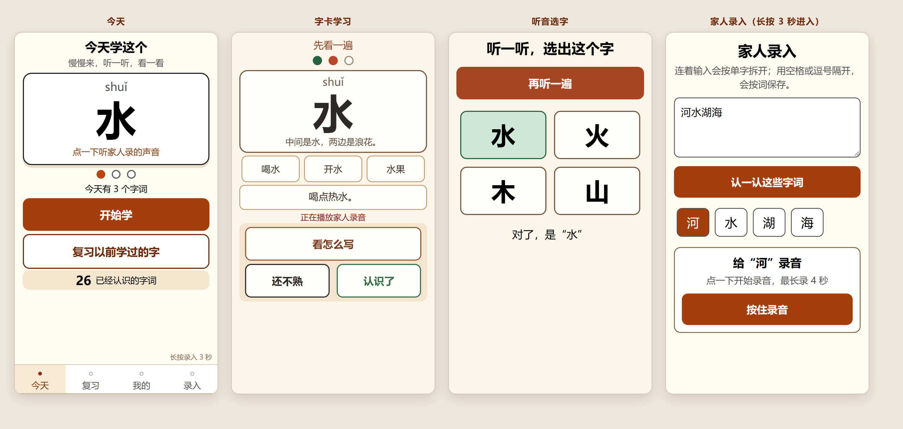

# 妈妈学认字

> 给不识字的长辈做的一款「听音认字」微信小程序。
> 一台手机、一个人用，不用注册登录，装好就能学；**所有数据都留在这台手机里，不联网、不上传**。


---

## 目录

- [这是什么](#这是什么)
- [界面预览](#界面预览)
- [两种角色怎么用](#两种角色怎么用)
- [功能清单](#功能清单)
- [跑起来](#跑起来)
- [换成你自己的小程序](#换成你自己的小程序)
- [项目结构](#项目结构)
- [内置内容](#内置内容)
- [数据存在哪](#数据存在哪)
- [隐私与安全](#隐私与安全)
- [跑测试](#跑测试)
- [设计上的一些取舍](#设计上的一些取舍)
- [已知限制](#已知限制)
- [数据来源与致谢](#数据来源与致谢)
- [许可](#许可)

---

## 这是什么

妈妈识字不多，但**说话一点问题没有**。她缺的不是语言能力，是「声音」和「字形」之间那根线。

这个小程序就是来连这根线的：

1. **先听** —— 点一下字，手机就读出来（优先读家人自己录的声音）。
2. **再看** —— 大字 + 拼音 + 一句大白话讲这个字为什么这么写。
3. **再选** —— 听读音，从 4 个大字里选出听到的那个，确认真的记住了。

不是给小孩做的识字 App，也不是语文学习软件。它只有一个目标：**让一位不识字的长辈，在自己家里、自己的手机上，认识生活中真正会用到的那些字。**

因为使用者可能完全不会打字、不认字，所以整个产品里**没有任何一处需要学习者输入文字** —— 她能做的只有三件事：点、听、选。

---

## 界面预览



从左到右：今天 / 字卡学习 / 听音选字 / 家人录入。

---

## 两种角色怎么用

### 学习者（妈妈）

打开小程序，一天只需要三个动作：

| 步骤 | 做什么 | 对应按钮 |
|---|---|---|
| 1 | 看看今天要学什么，点一下大字先听一遍 | 点字卡 |
| 2 | 一个字一个字地学，会了就点「认识了」，不确定就点「还不熟」 | 开始学 |
| 3 | 学完做几道「听音选字」，然后收工 | 自动进入 |

几个刻意的设计：

- **不需要打字，不需要登录，不需要选班级。**
- 答错**不批评、不放刺耳音效**，只温和地显示正确答案并再读一遍，停留时间也长一点。
- 进度用**一排大圆点**表示，而不是「第 2/4 个」这种要读数字才懂的形式。
- 一轮里标记「还不熟」的字，会在**本轮末尾再出现一次**；第二轮不再无限循环。
- 底部四个标签：**今天 / 复习 / 我的 / 录入**。

### 家人（负责录入）

「录入」是**家人专用的隐藏入口** —— 必须在底部导航的「录入」上**按住 3 秒**才会进入，防止老人误触。按住时按钮上会显示倒计时。

进去之后可以做这些事：

| 想做的事 | 怎么操作 |
|---|---|
| 加几个字 | 连着输入「河水湖海」，点「加入学习」，自动拆成 4 张单字卡并加入今天 |
| 加几个词 | 用空格或逗号隔开：「医院 银行」，点「加入学习」，得到 2 张词卡 |
| 听读音 | 点列表里的文字；有家人录音时优先播放家人录音 |
| 补充资料 | 点字词下面的「补充」，填写常用词、例句和记忆提示 |
| 录自己的读音 | 点「录音」，按 3、2、1 倒计时录制，最长约 4 秒；再次点「已录」可以确认删除 |
| 调整今天的安排 | 点某个字词的「拿掉」，或点列表右上角的「清空」 |
| 不想要今天的自定义内容 | 什么都不用做 —— 第二天自动回到内置课程进度 |

> 拼音会**按离线拼音表自动填好**，常用组词也会自动给几个，家人通常只需要录个音就行。

---

## 功能清单

### 今天（首页）
- 显示今天要学的字/词：大字 + 拼音，点一下立刻听读音。
- 「开始学」主按钮 + 「复习以前学过的字」次按钮。
- 显示已认识的字词数。
- 家人当天没安排内容时，**自动接着内置课程里下一课没学完的字**。

### 字卡学习
- 每张卡包含：大字/词、拼音、字形记忆提示、常用组词、例句。
- 进入自动读一遍；点字、点组词、点例句都能**分别发音**。
- 按钮：「看怎么写」「还不熟」「认识了」。

### 听音选字
- 自动读题，从最多 4 个大字里选。
- **干扰项只从教过的字里取**，不会冒出没学过的字；**同音字不作为干扰项**（避免听音无法区分）。
- 选完显示正确答案并再读一遍。

### 复习
- 自动列出到期该复习的字，点大字可听读音。
- 「开始复习」复用字卡学习 + 听音选字的完整流程。
- 没有到期内容时，用大白话显示空状态，不是冷冰冰的「暂无数据」。

### 笔顺和描红
- 从字卡点「看怎么写」进入。
- 用小程序原生 canvas 播放**逐笔笔顺动画**，不依赖任何浏览器端第三方库。
- 提供「再放一遍」「我也写一遍」「擦掉重写」「写好了」。
- 描红区尽量大，方便手指书写，并避开底部系统手势区。
- 没有该字的笔顺数据时，显示「这个字还没有笔顺动画，可以在下面照着写」，**不白屏**。

### 我的
- 已认识字词数、连续学习天数、今天安排数量、到期复习数量、当前课程与课次。
- 明确提醒：**本地数据在换手机、清理微信缓存或卸载后会丢失。**

---

## 跑起来

### 环境

- [微信开发者工具](https://developers.weixin.qq.com/miniprogram/dev/devtools/download.html)（稳定版即可）
- 基础库 **3.17.2** 或更高
- 不需要 Node.js、不需要 npm install —— **项目零第三方依赖**

### 步骤

```bash
git clone https://github.com/paidad/StudyMM_chinese-literacy-miniprogram.git
```

1. 打开微信开发者工具 → **导入项目**
2. 目录选择刚克隆下来的文件夹
3. AppID 处填你自己的小程序 AppID（见下一节），或选「**测试号**」
4. 导入后点「**编译**」

首页应该直接显示「今天学这个」和一张字卡。

> 音频和笔顺数据都在仓库里（约 8 MB），克隆完就能离线跑，不需要额外下载资源。

---

## 换成你自己的小程序

仓库里 `project.config.json` 使用微信开发者工具的游客占位符 `touristappid`。如需真机预览或上传发布，**请换成你自己的小程序 AppID**：

```json
{
  "appid": "你的小程序 AppID"
}
```

没有 AppID 的话，可以在微信开发者工具里选择「测试号」进行本地体验；真机预览和正式发布仍需使用你自己的 AppID。

> `project.private.config.json`（开发者工具的本机配置）已在 `.gitignore` 中，不会被提交。

---

## 项目结构

```
.
├── app.js / app.json / app.wxss      # 小程序入口与全局样式
│
├── pages/                            # 主包：四个底部标签页
│   ├── index/                        #   今天
│   ├── review/                       #   复习
│   ├── profile/                      #   我的
│   └── input/                        #   家人录入（长按 3 秒进入）
│
├── study/                            # 分包 1：学习流程
│   ├── pages/learn/                  #   字卡学习 + 听音选字
│   ├── data/phrase-map.js            #   整词/整句音频索引
│   └── audio/                        #   292 条内置课程音频
│
├── stroke/                           # 分包 2：笔顺
│   ├── pages/write/                  #   笔顺动画 + 描红 canvas
│   ├── data/strokes.js               #   2988 个字的笔顺中线数据
│   └── utils/stroke-geometry.js      #   笔顺坐标换算
│
├── data/                             # 内容与索引（主包）
│   ├── builtin-course-data.js        #   35 课 / 210 字的出厂课程
│   ├── course.js                     #   课程读取与缓存
│   ├── pinyin.js                     #   离线拼音表
│   └── words.js                      #   常用组词索引
│
├── audio-py/                         # 964 个拼音音节音频（离线兜底发音）
│
├── utils/                            # 纯逻辑层，全部可独立测试
│   ├── srs.js                        #   间隔复习算法
│   ├── learning-queue.js             #   学习队列与选字干扰项
│   ├── app-data.js                   #   今天学什么 / 连续天数
│   ├── storage.js                    #   本地存储读写与容错
│   ├── pronunciation.js              #   发音来源选择
│   ├── speech-data.js                #   汉字 → 音节音频路径
│   ├── input-parser.js               #   家人输入拆字/拆词
│   ├── recording.js                  #   录音文件名哈希
│   ├── audio-player.js               #   单段播放器
│   └── sequence-audio-player.js      #   多段顺序播放器
│
├── tests/                            # 19 个单元测试，零依赖
├── docs/preview.png                  # 本 README 的界面预览图
└── REBUILD_PROMPT.md                 # 原始产品需求与验收标准
```

**分包策略**：只有「学习」和「笔顺」放在分包里，且**只在用户点进对应功能时才下载**，启动首页不会同时拉取任何分包。

---

## 内置内容

装好就能学，不需要家人先准备任何东西：

| 内容 | 数量 |
|---|---|
| 内置课程 | **35 课** |
| 零基础常用字 | **210 个** |
| 拼音音节音频 | **964 条** |
| 课程整词/整句音频 | **292 条** |
| 笔顺中线数据 | **2988 个字** |

课程顺序是**刻意排的**，不是随机凑字：

- 第 1–10 课：家里物件、生活用品、穿戴衣物、身体部位、家人称呼和日常吃食。
- 第 11–19 课：居家动作、说话交流、时间天气、方位对比和最常用的判断词。
- 第 20–28 课：上街、坐车、通讯、医院、购物、银行、公共场所和家务劳动。
- 第 29–35 课：花草田地、情绪、常用物品、礼貌用语、生活动词和安全常识。

每课固定 6 个新字，210 个字互不重复；课程不再包含已经会的“一、二、三、四”等数字字。

后面的字都直接长在生活场景里，学完就能用上。

---

## 数据存在哪

**全部在这台手机的本地存储里，没有任何服务器。**

| 内容 | 位置 |
|---|---|
| 学习状态 | `wx.setStorageSync('mama_literacy_state_v1', ...)` |
| 家人录的音 | 小程序用户数据目录（文件名用稳定哈希，重录时先删旧文件） |
| 内置课程与音频 | 随小程序包一起，离线可用 |

存储结构：

```js
{
  version: 1,
  chars:      {},   // 字/词详情：char, pinyin, words, sentence, tip, lesson, updatedAt
  today:      {},   // { date, chars: [] }，保持家人安排的顺序
  progress:   {},   // 以字/词为键的 SRS 进度
  recordings: {},   // 字/词 → 录音文件路径
  stats:      {}    // 连续学习天数、总学习次数
}
```

复习进度至少保存这些字段：

```js
{ char, stage, right, wrong, firstAt, lastAt, nextAt }
```

> ⚠️ **请家人留意**：数据只在本地。**换手机、清理微信缓存、卸载微信**都可能导致学习记录和录音丢失。小程序「我的」页面里也有这句提醒。

---

## 隐私与安全

- 小程序不要求注册、登录，也没有云端账号体系。
- 学习进度、家人录音和当天任务只保存在微信小程序的本地存储与用户数据目录中。
- 仓库不会提交 `project.private.config.json`、开发者工具缓存或用户运行时录音。
- 公开仓库中的 `project.config.json` 只保留 `touristappid`，不包含维护者的真实小程序 AppID。
- 项目代码没有网络请求逻辑；README 中的徽章和外部链接只在浏览 GitHub 页面时由浏览器加载，不属于小程序运行逻辑。

---

## 跑测试

19 个单元测试，**零依赖**，只用 Node 内置的 `assert`，不需要安装任何东西：

```bash
for f in tests/*.js; do node "$f" || echo "FAIL $f"; done
```

Windows PowerShell：

```powershell
Get-ChildItem tests -Filter *.test.js | ForEach-Object {
  node $_.FullName
  if ($LASTEXITCODE -ne 0) { throw "测试失败：$($_.Name)" }
}
```

覆盖范围：SRS 算法、学习队列、选字干扰项、输入拆解、本地存储容错、发音选择链、音频播放器、笔顺几何、页面路由与学习流程。

所有 `utils/` 下的模块都是**纯函数 + 依赖注入**（例如 `storage.js` 把 `wx.getStorageSync` 当参数传进来），所以能脱离小程序环境直接跑。

---

## 设计上的一些取舍

### 发音优先级

声音是这个小程序的命根子。四种来源按下面的顺序降级，**任何一级都可用就不往下走**：

1. **家人在本机录的声音** —— 最亲切，也是妈妈最认的声音。
2. **预生成的整词/整句音频** —— 保留自然连读和语调。
3. **按拼音音节文件逐字播放** —— 离线兜底，机器音但保证有声。
4. **全都不可用** —— 用人话提示「还没有声音，请家人录一遍」，**绝不静默无反应**。

### 复习算法（SRS）

间隔档位固定 6 档：**30 分钟 / 1 天 / 3 天 / 7 天 / 15 天 / 30 天**。

- **第一次看见一个字，只建立第 0 档**（30 分钟后再复习），不会把「第一次看见」当成答对升级 —— 这是刻意的，避免刚认识就跳到 1 天后。
- 之后答对升一档，答错退一档，最低第 0 档，最高 30 天档。

### 适老尺寸（写死在样式里）

- 字卡主字 **150rpx**（不小于 120rpx）
- 正文 **32–36rpx**（不小于 36rpx 用于关键信息）
- 主按钮高度 **116–120rpx**
- 一屏尽量只做一件事；文案用日常口语，不用技术词
- 所有可点元素都有明显的按下反馈

### 为什么代码写得这么「保守」

这套代码的写法**看起来偏老派**：`var`、不用可选链、不用自定义组件、不在 `App()` / `Page()` 之前 require 大数据、WXML 里不写复杂表达式。

这不是风格偏好，是**为了兼容性**。原始需求（见 [`REBUILD_PROMPT.md`](REBUILD_PROMPT.md)）记录了一个真实故障：旧版本在微信开发者工具和 iPhone 上正常，但在**鸿蒙（OpenHarmony）设备**上首页白屏 —— 报错 `Page "pages/index/index" has not been registered yet`，WXML 树里只有 `<page>` 没有子节点。

所以这个版本是**按阶段从零重建**的，并且刻意回避了：

- 自定义组件、`lazyCodeLoading`
- 启动分包预下载、`require.async`
- 启动音频预热
- CSS 变量
- 非必要的编译特性

如果你要在主流机型上跑，这些限制其实可以放宽；但如果你想兼容鸿蒙这类环境，**建议保留这些写法**。

---

## 已知限制

- **数据不跨设备**。换手机需要重新学。这是刻意的取舍 —— 换来的是「不用登录、不用联网、不怕隐私外泄」。
- **笔顺只覆盖 2988 个字**，超出范围的字会显示提示，不会白屏。
- **录音最长约 4 秒**，够录一个字或一个词。
- **未在全部机型上验证**。原作者的主要验证环境包含鸿蒙真机、iPhone 和普通 Android，但不同厂商的微信内核对音频和 canvas 的处理仍有差异。
- **README 里的界面预览图**是用样式数值等比例还原的静态预览（小程序没有本地模拟器），版式与实际一致，但不代表真机像素级完全相同。

---

## 数据来源与致谢

- **笔顺数据**：[hanzi-writer-data](https://github.com/chanind/hanzi-writer-data)（MIT License）
- **拼音与组词**：项目内置的离线数据表

---

## 许可

[MIT License](LICENSE)

---

> 这个项目最初的动机很简单：**想让妈妈能自己看懂药盒上的字、银行里的字、公交车上的字。**
> 如果它对你家里的长辈也有用，欢迎随意取用、修改、再发布。
